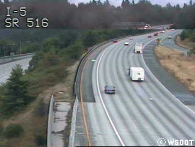
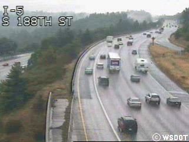
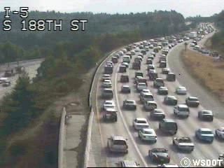
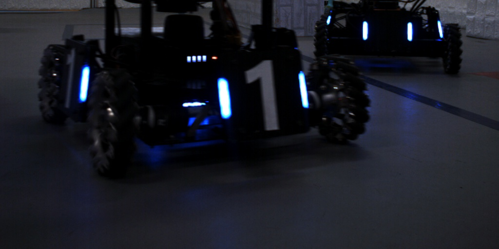
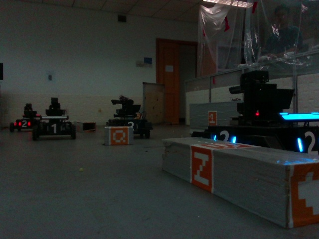
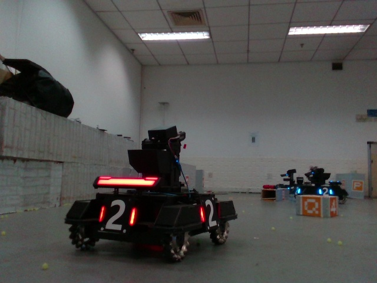
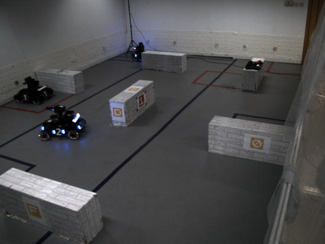
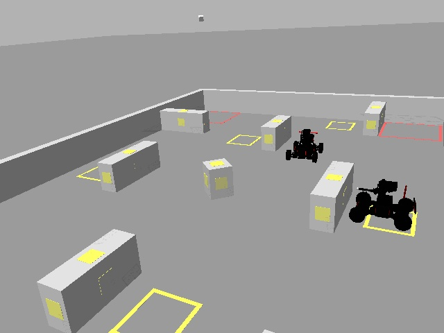

# Datasets-for-ABCP

## The UCSD dataset

    
  
The UCSD dataset is a small dataset captured from the freeway surveillance videos collected by UCSD. This dataset involves three different traffic densities each making up about one-third: the sparse traffic, the medium-density traffic, and the dense traffic. We define three classes in this dataset: truck, car, and bus. The resolutions of the images are all 320×240. The training and testing sets contain 683 and 76 images respectively.

## The mobile robot detection dataset

  

    
  
The mobile robot detection dataset is collected by the robot-mounted cameras to meet the requirements of the fast and lightweight detection algorithms for the mobile robots. There are two kinds of ordinary color camera with different resolutions which are 1024×512 and 640×480 respectively. Five classes have been defined: red robot, red armor, blue robot, blue armor, dead robot. The training and testing sets contain 13,914 and 5,969 images respectively. During collecting, we change series of exposure and various distances and angles of the robots to improve the robustness.
  
## The sim2real dataset
  

  

The sim2real detection dataset is divided into two sub-datasets: the real-world dataset and the simulation dataset. We search and train the model on the simulation dataset and test it on the real-world dataset. Firstly, we collect the real-world dataset by the surveillance-view ordinary color cameras in the field. The field and the mobile robots are the same as those in the mobile robot detection dataset. Secondly, we leverage Gazebo to simulate the robots and the field from the surveillance view. Then we capture the images of the simulation environment to collect the simulation dataset. The resolutions of images in the sim2real dataset are all 640×480. There is only one object class in these two datasets: robot. The training and testing sets of the simulation dataset contain 5,760 and 1,440 respectively, and the testing set of the real-world dataset contains 3,019 images.

The format of the labels is relative xywh coordinates. The documents named train.txt and test.txt list the image paths of the training dataset and the testing dataset respectively, and are used for the YOLOv3 training on Darknet.  The documents named search_train.txt and search_test.txt list the image paths and the labels of the training dataset and the testing dataset respectively, and are used for the pruning policy search. It is worth noting that the format of the labels is absolute xxyy coordinates. 
